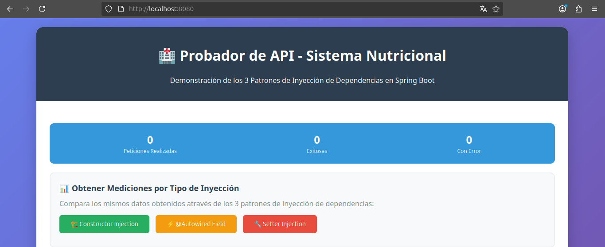
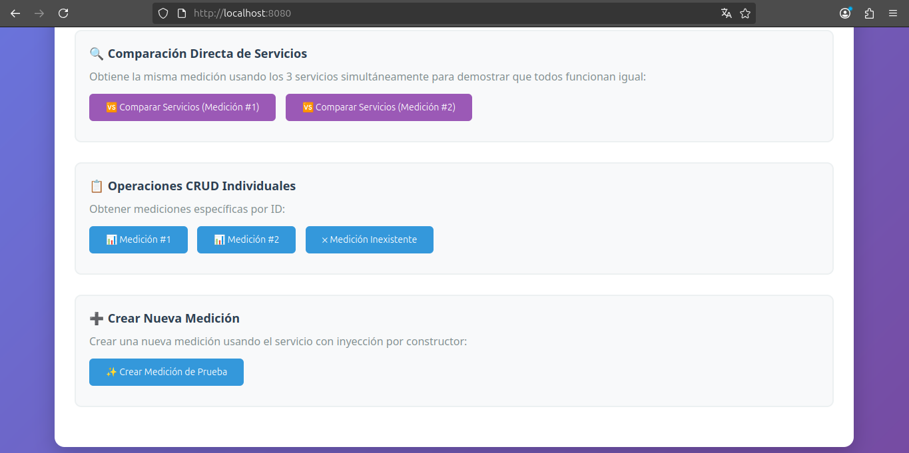
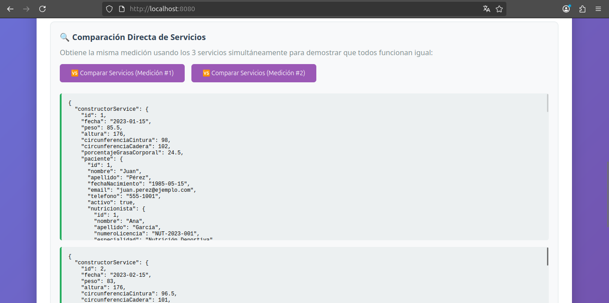
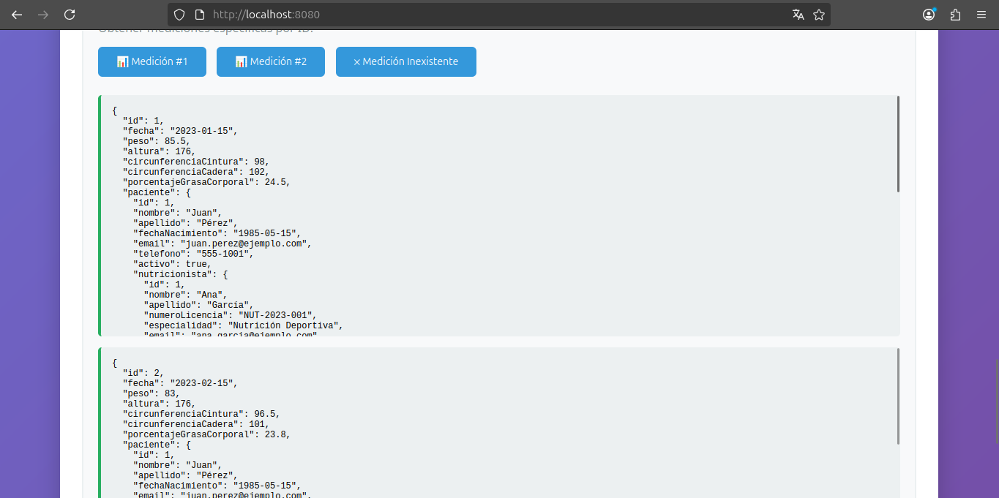
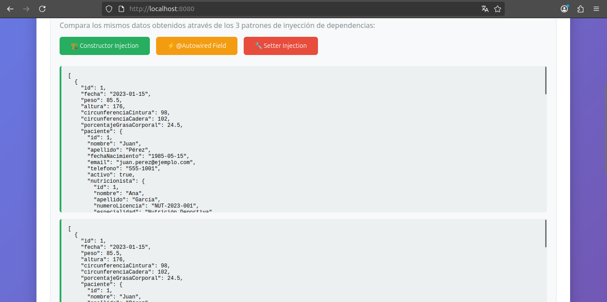

# TutorialSpringBoot-H2
Spring Boot con H2: Sistema de Gestión de Nutrición

## Capturas de Pantalla

### Interfaces de Usuario

*Interfaz principal del sistema de gestión de nutrición*

*Vista detallada de la aplicación*

### Servicios y Funcionalidades

*Servicios y endpoints disponibles en la aplicación*

### Búsqueda y Consultas

*Funcionalidad de búsqueda por ID*

### Mediciones y Datos

*Sistema de mediciones y datos nutricionales*

